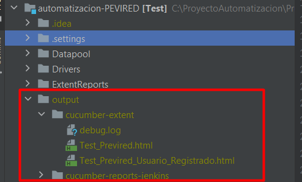

selenium-cucumber-java
=================

selenium-cucumber : Automatizacion usando Java

seleniumm es esta impulsado por el comportamiento BDD, la cual consta de escribir script de prueba automatizadas.

[Mas Detalles](https://cucumber.io/)

Instalación
-----------

Prerequisitos
* Java
* Maven
* IntelliJ
* IntelliJ Plugin
  * Cucumber for Java
  * Maven

Configuración inicial

* Instalar Java corretto-1.8 dentro de intelliJ seccion File/Proyect Structure, en proyect seleccionar el SDK.
* Instalar Maven y establece la ruta.

Drivers para ejecucion en la WEB
-
Para poder realizar la ejecución de los test, es necesario obtener el driver de cada navegador, en este caso se utilizo el driver de chrome, en la que se debe alojan en la siguiente ruta

Uso de archivos de Prueba
-
Para la construcción de los Test se utilizo una parametrizacion, la cual va a leer a unos archivos los datos que utilizara el sistema, estos archivos se encuentran en la siguiente ruta:

Escritura de un TEST
--------------

para agregar un nuevo test, se debe agregar un `features` a la carpeta testfeatures con la extencion ".feature".

Ejecutar un test
--------------
En la siguiente imagen se visualiza el modo de ejecución mediante intelliJ

Para realizar la ejecucion mediante commando.
* `mvn test`
* `mvn test -Dcucumber.options="--tags @TAGS"`

Donde @TAGS corresponde al tags que contiene cada feature

Reporteria
-
En la siguiente ruta se encuentran alohjados el informe escrito en html, este informe se genera de forma automatica una vez ejecutado el test

* Las evidencias obtenidas durante la ejecución las podemos obtener en:
